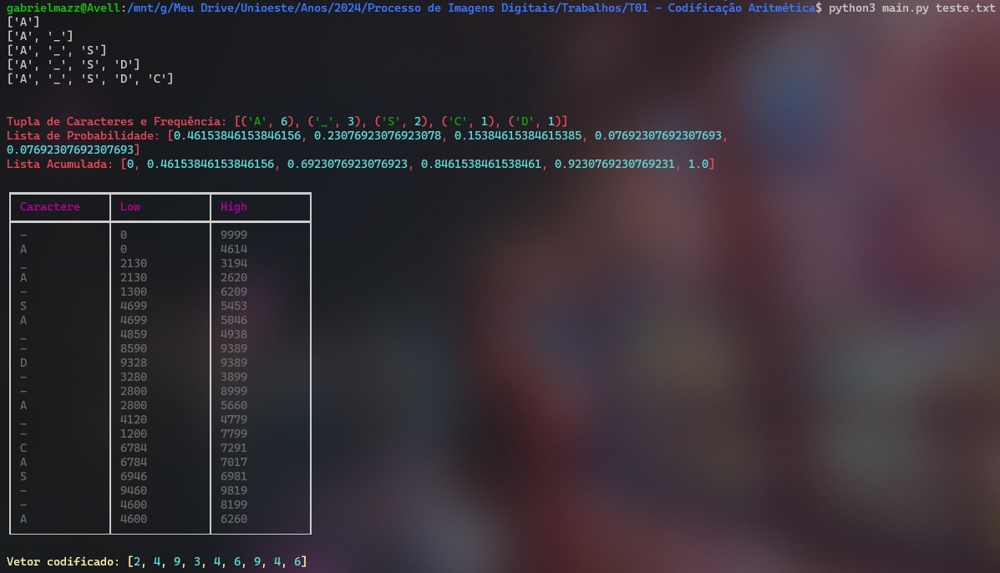

# <p align="center">Algoritmo de Codificação Aritimética</p>
#### <p align="center">Trabalho de Processo de Imagens Digitais, faculdade de Ciência da Computação, UNIOESTE (Universidade Estadual do Oeste do Paraná)</p>
##### <p align="center">Desenvolvido por: [Gabriel Mazzuco](https://github.com/gabrielmazz)

## Indice

- [Descrição do Projeto](#descrição-do-projeto)
- [Pré-requisitos](#pré-requisitos)
    - [Requisitos para o projeto](#requisitos-para-o-projeto)
    - [Requisitos mínimos de hardware](#requisitos-mínimos-de-hardware)
- [Como usar](#como-usar)
- [Referências](#referências)

## Descrição do Projeto

<p align="justify">O projeto consiste em um algoritmo de codificação aritimética, que é um método de compressão de dados, consistindo em representar a probabilidade da ocorrência de cada caractere de acordo com intervalos cumulativos</p>

<p align="justify">Parte-se do intervalo [0,1[ e nele identifica-se o sub-intervalo ao qual corresponde o primeiro símbolo lido do arquivo</p>

<ul align="justify">
    <li>Para cada símbolo subsequente, subdivide-se o intervalo atual em sub-intervalos proporcionais às probabilidades da tabela de intervalos, e encontra-se novamente o intervalo que corresponde ao próximo símbolo</li>
    <li>No final do processo, temos um intervalo que corresponde à probabilidade da ocorrência de todos os símbolos na ordem correta</li>
</ul>

## Pré-requisitos

### Requisitos para o projeto

<p align="justify">Para o projeto, é necessário ter instalado em sua máquina as seguintes ferramentas:</p>

- [Python](https://www.python.org/downloads/), versão 3.8.5 ou superior
    - `sudo apt-get install python3.8`

- [Rich](), versão 9.2.0 ou superior
    - `pip install rich`
    - Usado no código para criação de tabelas e logs mais organizados sobre a demonstração do log do algoritmo
    
### Requisitos mínimos de hardware

- Sistema operacional: Linux (Ubuntu 20.04.2 LTS)
- Processador: dual-core 1.6GHz ou superior
- Memória RAM: 2GB ou superior
- Espaço em disco: 1GB ou superior

## Como usar

<p align="justify">Para usar o projeto, é necessário ter instalado em sua máquina as ferramentas citadas em <a href="#requisitos-para-o-projeto">Requisitos para o projeto</a></p>

<p align="justify">Para executar o projeto, basta executar o arquivo <a href="main.py">main.py</a> junto ao arquivo de texto que deseja comprimir, como no exemplo abaixo:</p>

```bash
python3 main.py teste.txt
```

### Exemplo de saída

<p align="center">
    

<p align="justify">O arquivo <a href="teste.txt">teste.txt</a> deve apenas conter a string que deseja comprimir, como no exemplo abaixo:</p>

```txt
A_ASA_DA_CASA
```

<p align="justify">A saída do programa se baseia na <u>frequência</u> em que cada caractere aparece no arquivo, sua <u>lista de probabilidades</u> e a <u>lista acumulada</u>. Por fim é criado uma tabela com os cálculos de cada caractere e sua probabilidades, low e high, no final é dado o vetor codificado da string

## Referências

- [Codificação Aritimética](https://pt.wikipedia.org/wiki/Codificação_aritmética)
- [Compressão sem Perdas: Codificação Huffman e Aritmética](https://www.inf.unioeste.br/~adair/PID/Notas%20Aula/Codificacoes%20Huffman%20e%20Aritmetica.pdf)